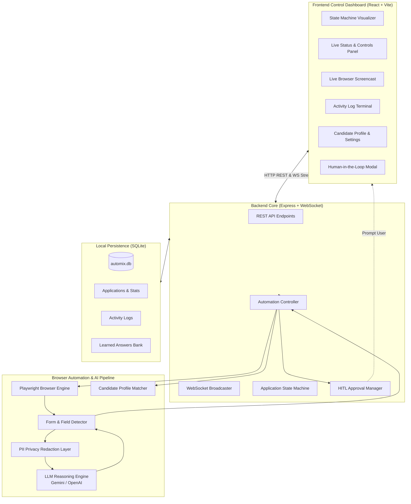
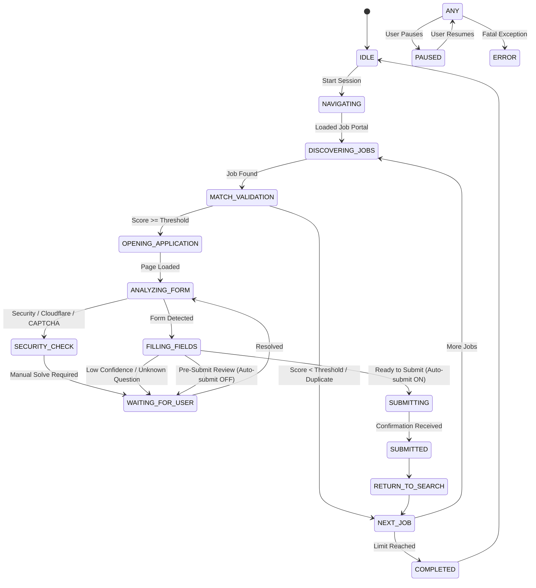

# AutoMix — Autonomous AI Job Application Agent

[](https://www.typescriptlang.org/)
[](https://nodejs.org/)
[](https://playwright.dev/)
[](https://react.dev/)
[](https://vitejs.dev/)
[](https://github.com/WiseLibs/better-sqlite3)
[](LICENSE)

**AutoMix** is an intelligent, full-stack autonomous job application agent designed to automate the discovery, evaluation, and completion of online job applications. Powered by **Playwright browser automation**, **LLM-driven contextual form reasoning (Google Gemini / OpenAI)**, and a **real-time reactive control dashboard**, AutoMix puts job hunting on smart, transparent autopilot while keeping you firmly in control.

---

## Architecture Overview



---

## Key Features

- **Autonomous Job Discovery & Filtering**: Scans job portals (e.g. RemoteOK, company career pages, Greenhouse, Lever) and calculates a weighted semantic match score against your profile skills, automatically skipping low-scoring or duplicate postings.
- **Smart Multi-Step Form Parsing**: Dynamically detects single-step and multi-wizard forms, inputs, checkboxes, dropdowns, radio groups, and resume file uploaders.
- **Privacy-Preserving LLM Reasoning**: Answers open-ended employer questions (e.g., *“Why are you interested in this role?”, “Describe your experience with distributed systems”*) using Google Gemini or OpenAI, while running local PII sanitization to prevent sensitive data leakage.
- **Human-in-the-Loop (HITL) Gatekeeper**: Pauses automation and alerts you whenever it encounters CAPTCHAs, two-factor authentication, low-confidence questions, or requests final approval before form submission.
- **Learned Answers Memory Bank**: Persists user responses in SQLite so recurring questions across different applications are answered automatically in the future.
- **Live Visual Screencast & Action Stream**: Real-time Playwright browser viewport screencast and color-coded event stream broadcast directly to the dashboard over WebSockets.
- **Obsidian Black & Grey Design System**: Premium, distraction-free monochrome interface engineered with deep obsidian charcoal panels, silver status indicators, and subtle glassmorphic elevations.
- **Local & Private**: Zero external telemetry. All candidate data, history, credentials, and logs remain securely stored in your local SQLite database.

---

## Tech Stack

| Layer | Technologies |
|---|---|
| **Backend** | Node.js, Express 5, TypeScript 5.9, WebSocket (`ws`), Better-SQLite3, Zod |
| **Automation** | Playwright (Chromium), Stealth emulation, Pop-up dismissal, Cookie persistence |
| **AI / LLM** | OpenAI API standard, Google Gemini (via OpenAI compatibility layer) |
| **Frontend** | React 18, Vite 6, TypeScript, Lucide Icons, Obsidian Black & Grey Glassmorphic UI |
| **Database** | SQLite with WAL (Write-Ahead Logging) mode enabled for high-performance concurrency |

---

## Finite State Machine (FSM)

AutoMix transitions through well-defined states to ensure deterministic execution and seamless pause/resume capabilities:



---

## Getting Started

### 1. Prerequisites

- [Node.js](https://nodejs.org/) v18.0.0 or higher
- `npm` (v9+) or `pnpm`
- Modern browser or Playwright Chromium binaries

### 2. Clone the Repository

```bash
git clone git@github.com:RamCharanTejaKesarapu/automix.git
cd automix
```

### 3. Install Dependencies

Install root backend dependencies, Playwright browser binaries, and client frontend dependencies:

```bash
# Install root backend dependencies
npm install

# Install Playwright browser engine
npx playwright install chromium

# Install frontend dashboard dependencies
cd client && npm install && cd ..
```

### 4. Configure Environment Variables

Create your `.env` configuration file in the project root:

```bash
cp .env.example .env
```

Edit `.env` with your API credentials and preferences:

```env
# AI Model Configuration (Gemini 2.5 Flash / OpenAI)
OPENAI_API_KEY=your_gemini_or_openai_api_key
OPENAI_BASE_URL=https://generativelanguage.googleapis.com/v1beta/openai
OPENAI_MODEL=gemini-2.5-flash

# Server Configuration
PORT=4000
HOST=localhost

# Automation Settings
HEADLESS=false
AUTO_SUBMIT_DEFAULT=false
```

---

## Running the Application

### Development Mode

Run backend and frontend concurrently in two separate terminal windows:

```bash
# Terminal 1: Backend Server (runs on http://localhost:4000)
npm run dev:server

# Terminal 2: Frontend Dashboard (runs on http://localhost:5173)
npm run dev:client
```

Open [http://localhost:5173](http://localhost:5173) in your browser to launch the control dashboard.

### Production Build

```bash
# Compile TypeScript server and bundle frontend with Vite
npm run build

# Start production server
npm start
```

### Automated Testing

Run the automated unit test suite verifying job pre-filtering, seniority exclusion, and field mapping:

```bash
npm test
```

---

## Project Structure

```
automix/
├── client/                           # React + Vite Frontend Dashboard
│   ├── public/                       # Favicon and SVGs
│   ├── src/
│   │   ├── components/               # UI components
│   │   │   ├── ActivityLogTerminal.tsx   # Live console log stream
│   │   │   ├── CandidateProfileEditor.tsx# Profile & skills editor
│   │   │   ├── Header.tsx                # App header & connectivity status
│   │   │   ├── HumanInTheLoopModal.tsx   # HITL prompt modal (CAPTCHA, questions)
│   │   │   ├── LiveMonitor.tsx           # Browser viewport screencast
│   │   │   ├── LiveStatusPanel.tsx       # Live status, target job & quick controls
│   │   │   ├── SessionConfigPanel.tsx    # Portal URL, threshold & keywords
│   │   │   ├── StateMachineVisualizer.tsx# Visual FSM step tracker
│   │   │   └── StatsGrid.tsx             # Real-time metrics counters
│   │   ├── App.tsx                   # Main layout and WebSocket handler
│   │   ├── index.css                 # Glassmorphic dark design system
│   │   └── types.ts                  # Shared client TypeScript types
│   ├── index.html
│   ├── package.json
│   └── vite.config.ts
├── src/                              # Backend Core
│   ├── ai/                           # LLM reasoning & PII sanitizer
│   │   ├── openai/                   # OpenAI/Gemini client & question-answer logic
│   │   └── privacyLayer.ts           # PII redaction layer
│   ├── applications/                 # Form automation engine
│   │   ├── applicationEngine.ts      # Multi-step form navigator & submission
│   │   ├── fieldMapper.ts            # Profile-to-form field mapping
│   │   ├── formDetector.ts           # DOM inspection & input classification
│   │   └── validator.ts              # Post-fill validation checks
│   ├── browser/                      # Browser management
│   │   ├── browserManager.ts         # Playwright lifecycle & screencasts
│   │   ├── pageManager.ts            # Safe typing, scrolling & popup dismissal
│   │   └── securityDetector.ts       # Cloudflare / CAPTCHA detection
│   ├── controller/                   # Automation orchestrator
│   │   └── automationController.ts   # Main automation runner loop
│   ├── database/                     # Persistence layer
│   │   ├── applications.ts           # SQLite queries for applications & logs
│   │   └── db.ts                     # SQLite connection & schema migrations
│   ├── human/                        # Human-in-the-loop coordination
│   │   └── approvalManager.ts        # HITL event emitter & prompt resolution
│   ├── jobs/                         # Job search & scoring
│   │   ├── jobDiscovery.ts           # Job link discovery from search boards
│   │   └── jobMatcher.ts             # Semantic skill matching & scoring
│   ├── profile/                      # Candidate data model
│   │   └── candidateProfile.ts       # Profile repository & default seed data
│   ├── server/                       # Express server
│   │   └── index.ts                  # API routes & WebSocket broadcaster
│   └── state/                        # State machine implementation
│       └── stateMachine.ts           # FSM state definitions & transitions
├── data/                             # SQLite database directory (gitignored)
├── uploads/                          # Resume PDF storage (gitignored)
├── package.json
└── tsconfig.json
```

---

## REST API & WebSocket Reference

### HTTP API Endpoints

| Method | Endpoint | Description |
|---|---|---|
| `GET` | `/api/status` | Current automation state, active context, and statistics |
| `GET` | `/api/profile` | Retrieve candidate profile details and preferences |
| `POST` | `/api/profile` | Update candidate profile details and preferences |
| `GET` | `/api/applications` | Historical job applications and outcome stats |
| `GET` | `/api/logs` | Retrieve recent activity logs |
| `GET` | `/api/learned-answers` | Retrieve all cached/learned answers from memory bank |
| `DELETE`| `/api/learned-answers/:id` | Delete a specific cached answer |
| `POST` | `/api/session/start` | Launch a new automated application session |
| `POST` | `/api/session/pause` | Pause currently running automation |
| `POST` | `/api/session/resume` | Resume paused automation |
| `POST` | `/api/session/stop` | Terminate active automation session |
| `GET` | `/api/hitl/prompt` | Retrieve currently pending HITL prompt (if any) |
| `POST` | `/api/hitl/respond` | Submit user response or decision to pending HITL prompt |
| `GET` | `/api/settings/llm` | Retrieve current LLM model and masked API key |
| `POST` | `/api/settings/llm` | Update LLM provider, base URL, model, or API key |
| `POST` | `/api/upload/resume` | Upload a PDF resume file for automated attachments |

### WebSocket Real-Time Events (`ws://localhost:4000`)

| Message Type | Direction | Payload Description |
|---|---|---|
| `STATE_UPDATE` | Server -> Client | FSM transition payload (`state`, `context`, `stats`) |
| `BROWSER_FRAME` | Server -> Client | Base64-encoded JPEG screenshot of the active browser |
| `NEW_LOG` | Server -> Client | New activity log entry with timestamp and severity |
| `HITL_PROMPT` | Server -> Client | Prompt data requesting user decision or CAPTCHA resolution |
| `HITL_RESOLVED`| Server -> Client | Confirmation of resolved prompt |

---

## Configuration Reference

| Variable | Type | Default | Description |
|---|---|---|---|
| `OPENAI_API_KEY` | String | *Required* | API key for Gemini or OpenAI |
| `OPENAI_BASE_URL` | String | `https://generativelanguage.googleapis.com/v1beta/openai` | OpenAI-compatible endpoint URL |
| `OPENAI_MODEL` | String | `gemini-2.5-flash` | LLM model identifier |
| `PORT` | Number | `4000` | Port for backend Express & WebSocket server |
| `HOST` | String | `localhost` | Hostname for server binding |
| `HEADLESS` | Boolean | `false` | Run browser in headless mode (`true`) or visible (`false`) |
| `AUTO_SUBMIT_DEFAULT` | Boolean | `false` | Automatically submit forms without HITL confirmation |

---

## Security & Ethical Automation

1. **Local Privacy**: No telemetry, analytics, or candidate profile information is uploaded to third-party services except the necessary prompts sent to your configured LLM API.
2. **PII Masking**: The local privacy redaction engine (`src/ai/privacyLayer.ts`) filters SSNs, phone numbers, and home addresses before prompts reach the LLM.
3. **Respectful Scraping**: Configurable rate limits and polite pacing between page navigations avoid overloading employer career servers.
4. **Human Verification**: AutoMix is engineered with human-in-the-loop safeguards to ensure you review and approve submissions whenever required.

---

## License

This project is licensed under the [MIT License](LICENSE).
